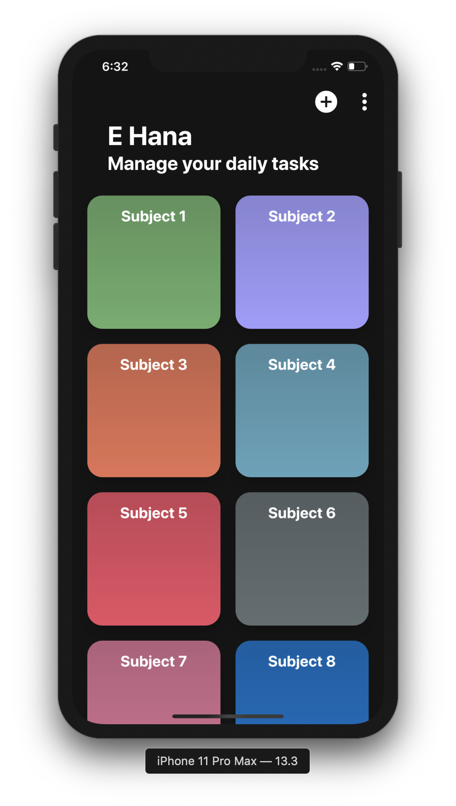
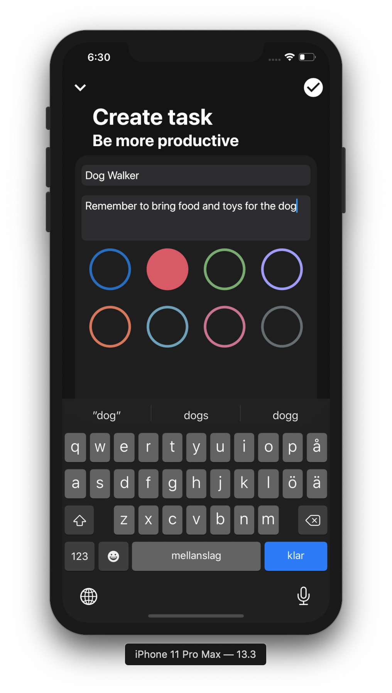
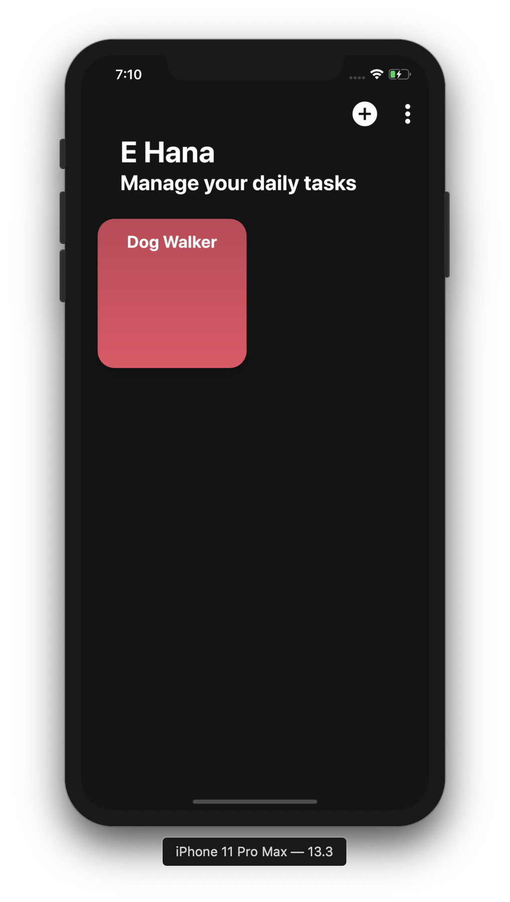
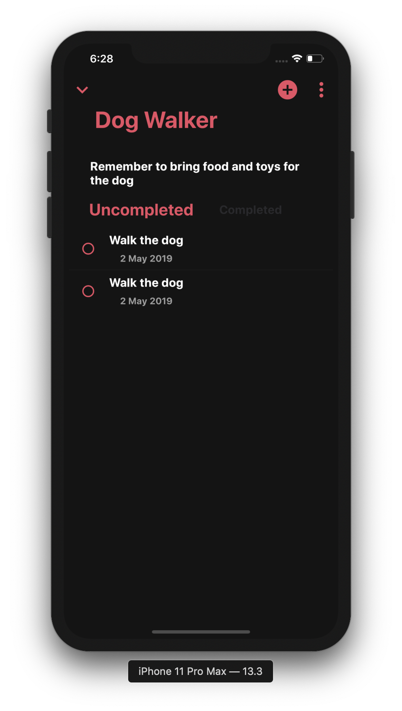
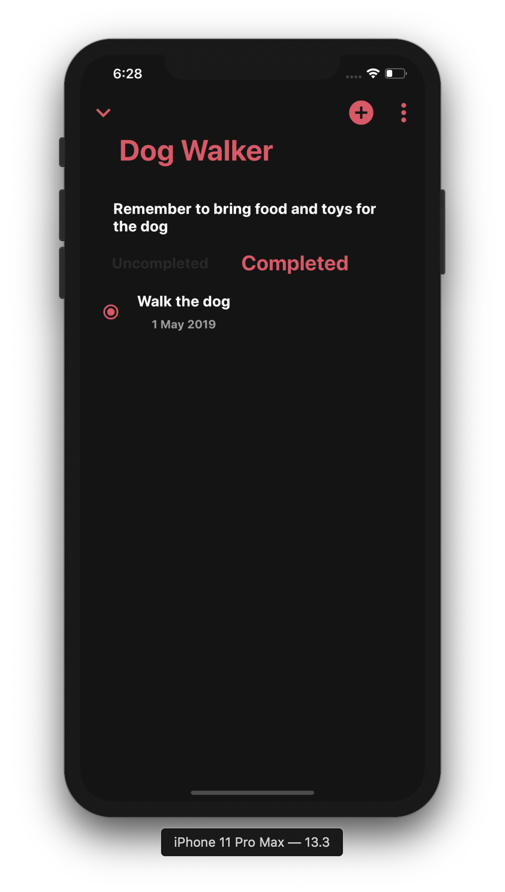
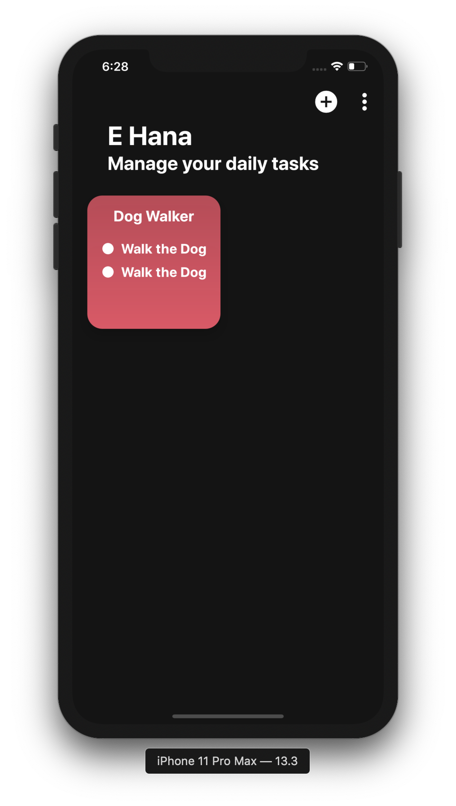

# E Hana: ToDo & Management App
The purpose with this app was to simplify the organization of different tasks I had in different subjects. 
This was done using [Flutter](https://flutter.dev).

## Prerequisites
[Flutter](https://flutter.dev).

## Running the program
1. Download Flutter [here](https://flutter.dev/docs/get-started/install).
2. Clone the project, `git clone https://github.com/robinrepowecklauf/ToDo-Management-App.git`.
3. Open your simulator of choice.
4. Navigate into `todo_management_app` and type `flutter run`.

## Error
If you are on a iPhone simulator, write `flutter clean` before you type `flutter run`.

## Screenshots

  
  
  
  
  
  

